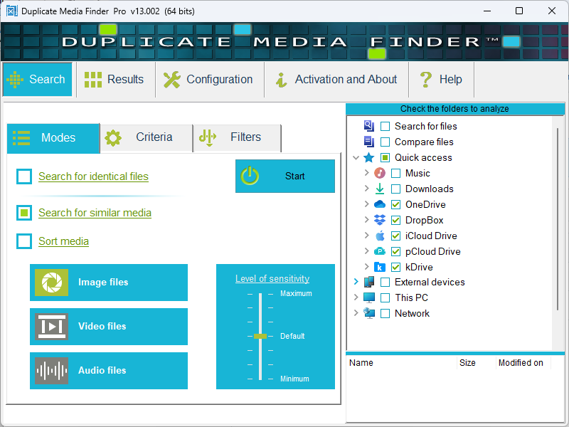
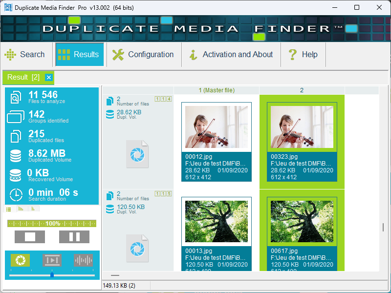

  

# Duplicate Media Finder
Fast and reliable duplicate file finder for Windows. Easily identify and remove identical files and similar documents (photos, images, music) to reclaim disk space. Take advantage of file management features to reorganize your files.

---

## 🚀 Overview
**Duplicate Media Finder** (DMF) is a high-performance utility designed for users who need to clean up their storage and regain control over their file organization. Whether you are dealing with thousands of vacation photos, massive music libraries, or cluttered document folders, this tool provides a safe and efficient way to eliminate redundancy.

## ✨ Key Features
*   **Precision Scanning:** Uses advanced comparison technology to find bit-for-bit identical files, even if they have different names.
*   **Media-Centric:** Optimized to handle large media formats (JPEG, PNG, RAW, MP3, MP4, etc.).
*   **Smart Reorganization:** Move, rename, or group files after detection to better structure your folders.
*   **Cloud Support:** Detect duplicates across all major cloud storage services.
*   **Mobile Devices:** Detect also duplicates on connected smartphones and tablets.
*   **Visual Preview:** Built-in previewer to check images and document properties before taking action.
 

*   ***More than just a duplicate finder:***
*   **Avanced Filtering**: Use powerful filters to search for files based on specific criteria (size, date, extension, etc.).
*   **Mass Renaming Module**: Includes an advanced renaming tool to organize your library efficiently.
 
  

  
  

---

## 👉 Duplicate Media Finder is available in three different editions:
*   **DEMO Edition**  
    Perfect for exploring the interface and testing the power of our detection algorithms. This version is intended for **technical evaluation** only and is not suitable for production use.

*   **FREE Edition**  
    A free, **100% functional** solution with no time limits or restrictions on the number of files processed. It allows you to permanently remove strictly identical duplicates.  
    *Note: This version does not include advanced features such as similarity detection (for visually or audibly close images, videos, or music).*

*   **PRO Edition**  
    The ultimate version that unlocks **all features**, including advanced similarity detection, without any restrictions.  
    👉 **[Purchase a PRO license on the official website](https://duplicate-media-finder.kdo-rg.com)**

 

Refer to the following comparison table to see the differences between the DEMO, FREE, and PRO editions: duplicate-media-finder.kdo-rg.com/dmf-versions.html

---

## 💾 Download Demo
The latest demonstration version for Windows is available in the **Releases** section.

1. Go to the [**Releases**](../../releases) page.
2. Download the installer for your system:
   - **`DuplicateMediaFinder_DEMO_x64_v<Version>_Setup`** (Recommended)
   - **`DuplicateMediaFinder_DEMO_x32_v<Version>_Setup`** (For 32-bit systems)
3. Run the **Setup** installer.
4. Follow the simple on-screen instructions to start reorganizing your files.

## 💾 Download Free
The latest free version for Windows is available in the **Releases** section.

1. Go to the [**Releases**](../../releases) page.
2. Download the installer for your system:
   - **`DuplicateMediaFinder_FREE_x32_v<Version>_Setup`** (For 32-bit & 64-bit systems)
3. Run the **Setup** installer.
4. Follow the simple on-screen instructions to start reorganizing your files.

## 💾 Download Pro
**[Purchase a PRO license on the official website](https://duplicate-media-finder.kdo-rg.com)**

## 🛡️ Security & Privacy
- **No Spyware / No Adware:** Duplicate Media Finder is a clean utility. It does not contain any malicious code or hidden tracking.
- **Privacy First:** The application scans your files locally. No data about your files or your system is ever uploaded to the internet.
- **Clean Uninstallation:** Thanks to the Setup installer, you can remove the software completely at any time through the Windows Control Panel.

## 🛠 Usage & Safety
- **Safe Mode:** Option to move duplicates to the Recycle Bin instead of permanent deletion.
- **Detailed Reports:** View exactly how much space you will gain before starting the cleanup.
- **Custom Filters:** Filter results by file size, date, or extension to focus on what matters.

---

## 📄 License & Terms
**Copyright (c) 2026 KDO-RG. All rights reserved.**

This repository provides the **demonstration/free version** of the software. 
*   The source code is proprietary and is **not** included in this repository.
*   You are authorized to use this demo for evaluation purposes.
*   The free version is fully authorized for personal or commercial use.
*   Redistribution of the demo/free executable is permitted, provided it remains unmodified.
*   Reverse engineering or decompilation is strictly prohibited.

## 📬 Support
If you encounter any issues or have suggestions for new features, please feel free to open an **[Issue](../../issues)** on this repository.

---
*Developed by KDO-RG - Focused on high-performance Windows utilities.*
